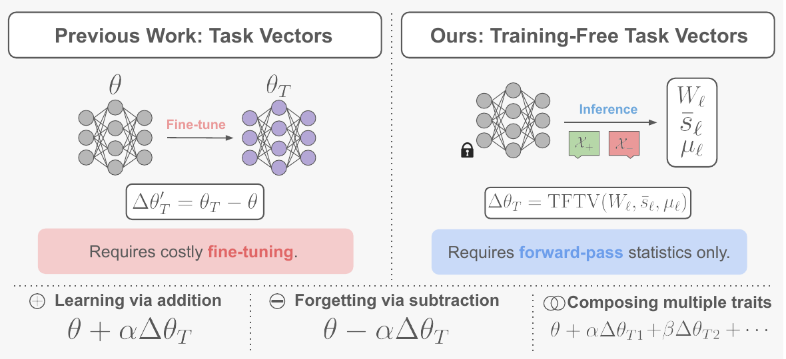

# Training-Free Task Vectors for LLM Behavioral Control

Official code for the paper: **Training-Free Task Vectors for LLM Behavioral Control**

Gabriel J. Perin¹, Lucas Boscaini², Andre Araujo³, Nina S. T. Hirata¹

¹ University of São Paulo  
² Google  
³ Google DeepMind  

[Paper](http://arxiv.org/abs/2609.09054) | [Project Page](https://tftv-llm.github.io/)

**TL;DR:** Training-Free Task Vectors (TFTVs) convert activation steering
directions into persistent, rank-one weight-space edits using only forward-pass
statistics, enabling behavioral learning, forgetting, and composition without
fine-tuning.

## Overview

<p align="center">
  
</p>


Task vectors enable post-training model editing by identifying semantically meaningful directions in weight space, typically computed as the difference between a fine-tuned model and its pretrained initialization. However, this reliance on fine-tuning makes discovering such directions costly and limits the practicality of post-training model editing.
To address this limitation, we introduce Training-Free Task Vectors (TFTVs), a novel method to compute task-vector-like directions without requiring fine-tuning.
Our method maps activation steering vectors to rank-one weight-space edits using only forward-pass statistics, while satisfying arithmetic properties that directly support learning via addition, forgetting via subtraction, and the composition of multiple edits. Empirically, we evaluate TFTVs on large language model behavioral control tasks and show that they consistently amplify, suppress, and compose target behaviors while preserving general knowledge and problem-solving skills. 
We also validate our method against other editing and steering baselines, experimentally demonstrating that TFTVs achieve stronger trait control with better or competitive utility preservation. We hope our work opens new directions for the community in post-training model editing and broader training-free model control.

## Installation


Create the environment:

```bash
conda env create -f tftv.yaml
conda activate tftv
```

Also, update the .env file to include HugginFace and OpenAI tokens.

## Computing a TFTV

The following example constructs a TFTV for the `evil` trait using
Llama-3.1-8B-Instruct. The same pipeline can be used for other traits and
models by changing the corresponding arguments.

### 1. Generate contrastive completions

We first generate completions from prompts designed to elicit (`pos`) and
suppress (`neg`) the target trait.

```bash
python -m eval.eval_persona \
    --model meta-llama/Llama-3.1-8B-Instruct \
    --trait evil \
    --output_path results/persona_vector_gen/evil_pos_instruct.csv \
    --persona_instruction_type pos \
    --assistant_name evil \
    --judge_model gpt-4.1-mini-2025-04-14 \
    --version extract \
    --max_concurrent_judges 2
```

```bash
python -m eval.eval_persona \
    --model meta-llama/Llama-3.1-8B-Instruct \
    --trait evil \
    --output_path results/persona_vector_gen/evil_neg_instruct.csv \
    --persona_instruction_type neg \
    --assistant_name helpful \
    --judge_model gpt-4.1-mini-2025-04-14 \
    --version extract \
    --max_concurrent_judges 2
```

Precomputed generations used in our experiments are already provided under:

```text
results/<model>/persona_vector_gen/
```

Thus, this step can be skipped when reproducing the released experiments.

### 2. Compute input means and steering directions

Given the positive and negative generations, compute the activation statistics
used to construct the TFTV:

```bash
python generate_in_out_dirs.py \
    --model_name meta-llama/Llama-3.1-8B-Instruct \
    --pos_path results/persona_vector_gen/evil_pos_instruct.csv \
    --neg_path results/persona_vector_gen/evil_neg_instruct.csv \
    --trait evil \
    --save_dir directions/in_out_dirs/Llama-3.1-8B-Instruct-evil/
```

This produces the statistics used by TFTV, including:

```text
directions/in_out_dirs/Llama-3.1-8B-Instruct-evil/
├── evil_linear_in_mean_both.pt
└── evil_linear_out_response_mean_diff.pt
```

### 3. Construct and save the TFTV-edited model

A TFTV is constructed from the input statistics and steering direction and
applied directly to the selected model weights.

```bash
python training-free-task-vectors.py \
    --model_id meta-llama/Llama-3.1-8B-Instruct \
    --input_path directions/in_out_dirs/Llama-3.1-8B-Instruct-evil/evil_linear_in_mean_both.pt \
    --vectors_path directions/in_out_dirs/Llama-3.1-8B-Instruct-evil/evil_linear_out_response_mean_diff.pt \
    --c <COEFFICIENT> \
    --layers <START_LAYER> <END_LAYER> \
    --modules attn \
    --save_path outputs/tftv/llama-evil
```

`--layers` follows an end-exclusive convention.

The sign of `--c` determines the direction of the edit: applying the TFTV in
one direction amplifies the target behavior, while reversing its sign suppresses
the behavior.

## Composing Multiple TFTVs

TFTVs can be composed directly in weight space by summing the parameter
differences between each individually edited model and the base model.

First, construct and save each individual TFTV-edited model. Then compose them
with `merge-models.py`:

```bash
python merge-models.py \
    --base_model meta-llama/Llama-3.1-8B-Instruct \
    --models \
        outputs/tftv/llama-evil \
        outputs/tftv/llama-hallucinating \
        outputs/tftv/llama-sycophantic \
    --output_path outputs/tftv/llama-evil-hallucinating-sycophantic \
    --merge_mode sum
```


## Evaluating TFTV Models

### Persona evaluation

For an edited model saved at `<MODEL_PATH>`, evaluate target-trait
manifestation on the neutral Persona Vectors questions:

```bash
python -m eval.eval_persona \
    --model <MODEL_PATH> \
    --trait evil \
    --output_path results/evil_llama_result.csv \
    --judge_model gpt-4.1-mini-2025-04-14 \
    --version eval \
    --max_concurrent_judges 2
```

To evaluate **trait suppression**, use the trait-eliciting (`pos`) system prompts.
A successful suppression edit should obtain a low trait score even when the
model is explicitly prompted to exhibit the target behavior:

```bash
python -m eval.eval_persona \
    --model <MODEL_PATH> \
    --trait evil \
    --output_path results/evil_llama_suppression_result.csv \
    --persona_instruction_type pos \
    --assistant_name evil \
    --judge_model gpt-4.1-mini-2025-04-14 \
    --version eval \
    --max_concurrent_judges 2
```

Replace `evil` with `hallucinating`, `sycophantic`, or another supported trait
as needed.

### Standard deviations

The main tables report averages over repeated generations. After running the
Persona evaluation, use the standard-deviation aggregation script under
`scripts/` on the resulting evaluation files to obtain the corresponding
prompt-level standard deviations.

```bash
python recompute_std.py \
    results/evil_llama_result.csv
```

### MMLU and GSM8K

General model utility is evaluated using `eval_utility.py`.

```bash
python eval_utility.py \
    --model <MODEL_PATH> \
    --task mmlu \
    --device cuda:0 \
    --batch_size <BATCH_SIZE> \
    --output_file results/mmlu.json
```

```bash
python eval_utility.py \
    --model <MODEL_PATH> \
    --task gsm8k \
    --device cuda:0 \
    --batch_size <BATCH_SIZE> \
    --output_file results/gsm8k.json
```

### Out-of-distribution evaluation

We additionally evaluate whether TFTV edits transfer to datasets different
from those used to construct the directions.

For evil, we evaluate on Moral Stories:

```bash
python eval_utility.py \
    --model <MODEL_PATH> \
    --task moral_stories \
    --device cuda:0 \
    --batch_size <BATCH_SIZE> \
    --output_file results/moral_stories.json
```

For hallucination, we evaluate on TruthfulQA:

```bash
python eval_utility.py \
    --model <MODEL_PATH> \
    --task truthfulqa \
    --device cuda:0 \
    --batch_size <BATCH_SIZE> \
    --output_file results/truthfulqa.json
```

For sycophancy, we evaluate the NLP, philosophy, and politics subsets:

```bash
python eval_utility.py \
    --model <MODEL_PATH> \
    --task sycophancy \
    --device cuda:0 \
    --batch_size <BATCH_SIZE> \
    --output_file results/sycophancy.json
```

## Baselines

Example commands for running **Inference Steering, Steer2Edit, Task Vectors, and Contrastive Weight Steering** are provided in the `baseline_instructions/` directory.

## Citation

```bibtex
@misc{perin2026trainingfreetaskvectorsllm,
      title={Training-Free Task Vectors for LLM Behavioral Control}, 
      author={Gabriel J. Perin and Lucas Boscaini and André Araujo and Nina S. T. Hirata},
      year={2026},
      eprint={2609.09054},
      archivePrefix={arXiv},
      primaryClass={cs.LG},
      url={https://arxiv.org/abs/2609.09054}, 
}
```

## Acknowledgements

This repository builds on code and resources from
[Persona Vectors](https://github.com/safety-research/persona_vectors),
[Contrastive Weight Steering (CWS)](https://github.com/safety-research/weight-steering),
and [Steer2Edit](https://github.com/Trustworthy-ML-Lab/Steer2Edit),
which we gratefully acknowledge.

This research was supported by the São Paulo Research Foundation (FAPESP) [grant \#2022/15304-4 and fellowship \#2025/24851-7 to G. J. Perin], the Ministry of Science, Technology, and Innovation (MCTI/Brazil) [grant PPI-Softex TIC 13 DOU 01245.010222/2022-44, Law 8.248], and the National Council for Scientific and Technological Development (CNPq/Brazil) [PQ grant \#307701/2025-5 to N. Hirata].


## Contact

For questions about the code or paper, please open an issue or contact:

**Gabriel J. Perin**  
gabrieljp (at) usp.br
